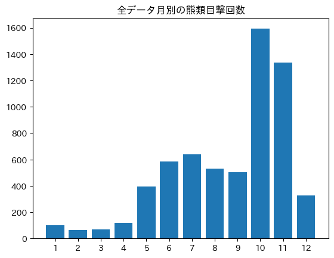
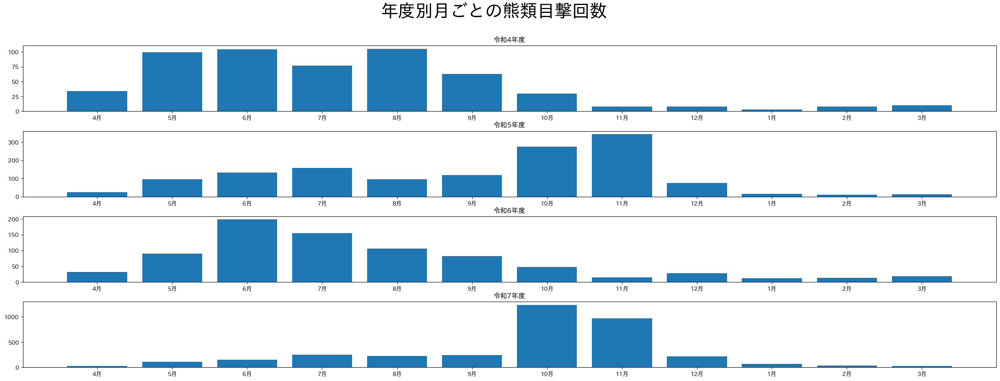
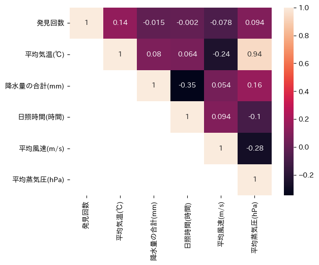
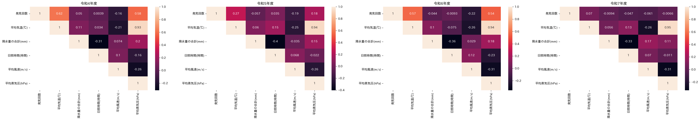
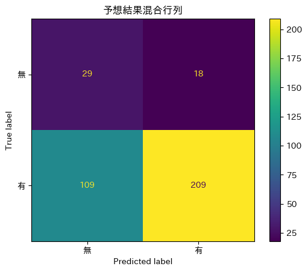
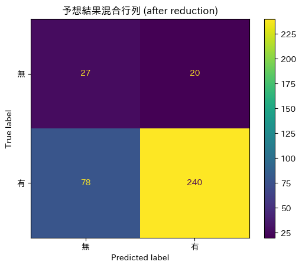
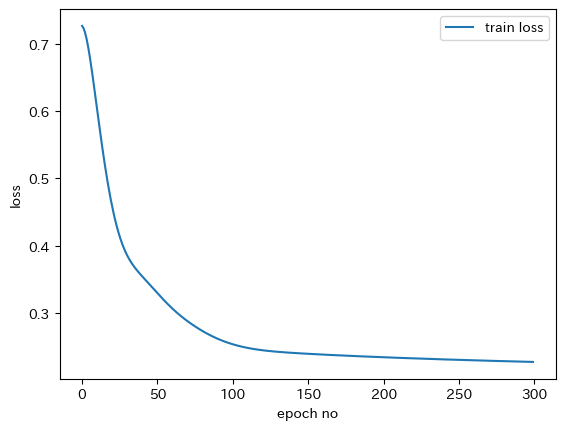
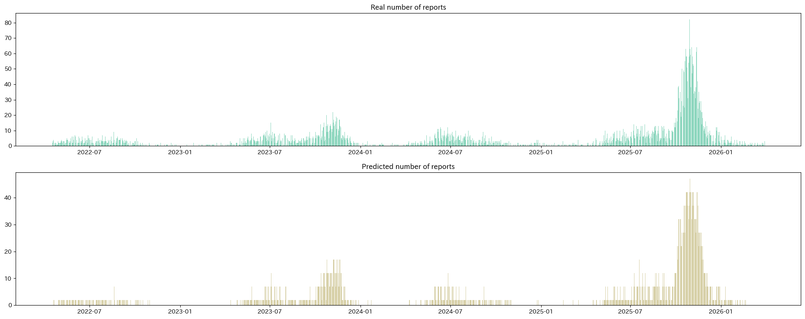

# Bear Weather Data Analysis
This was originally the project in the Information Society Study (情報社会学) course during the first semester of 2025. The repository has since been updated with revised code, improved structure, and an updated dataset to include full Reiwa 7 fiscal year.
This project analyzes the relationship between bear incident reports and historical weather conditions across fiscal years Reiwa 4 – Reiwa 7 (2022–2025). Each yearly period spans from April to March of the following year.

# Table of Contents
1. [Data](##Data)
2. [Bear Incidents by Month](#Bear-Incidents-by-Month)
3. [Time Series Decomposition](#Time-Series-Decomposition)
4. [Correlation Analysis](#Correlation-Analysis)
5. [Bear Encounter Prediction with RandomForest](#Bear-Encounter-Prediction-with-RandomForest)
6. [Bear Encountering Time Series Forecasting](#Bear-Encountering-Time-Series-Forecasting)

# Data
**Historical Weahter 2022/4/1 - 2026/3/31 Data** From Japan Meteorological Agency [気象庁](https://www.data.jma.go.jp/risk/obsdl/index.php) stored in `tenki.csv` \
**Bear incident reports between 2022/4/1 - 2026/3/31 within Miyagi prefecture** : Miyagi Prefectural Government \
Reiwa 4 (2022/4/1-2023/3/31) : [令和4年度クマ目撃等情報](https://www.pref.miyagi.jp/soshiki/sizenhogo/r4kuma.html) stored in `r4koukaiyou.xlsx` \
Reiwa 5 (2023/4/1-2024/3/31) : [令和5年度クマ目撃等情報](https://www.pref.miyagi.jp/soshiki/sizenhogo/r5kuma.html) stored in `r5koukaiyou.xlsx` \
Reiwa 6 (2024/4/1-2025/3/31) : [令和6年度クマ目撃等情報](https://www.pref.miyagi.jp/soshiki/sizenhogo/r6kuma.html) stored in `r6koukaiyou.xlsx` \
Reiwa 7 (2025/4/1-2026/3/31) : [令和7年度クマ目撃等情報](https://www.pref.miyagi.jp/soshiki/sizenhogo/r7kuma.html) stored in `r7koukaiyou.xlsx` 

## Weather data
`tenki.csv` consists of the following columns
- 平均気温(℃) - Average temperature (℃)
- ~平均気温(℃) - Additional flags of average temperature [not used here]~
- 降水量の合計(mm) - Precipitation (mm)
- ~降水量の合計(mm) - Additional flags of precipitation (mm) [not used here]~
- ~降水量の合計(mm) - Additional flags of precipitation (mm) [not used here]~
- 日照時間(時間) - Sunshine hours (h)
- ~日照時間(時間) - Additional flags of sunshine hours (mm) [not used here]~
- ~日照時間(時間) - Additional flags of sunshine hours (mm) [not used here]~
- 平均風速(m/s) - Average wind speed (m/s)
- ~平均風速(m/s) - Additional flags of average wind speed [not used here]~
- 平均蒸気圧(hPa) - Average vapor pressure (hPa)
- ~平均蒸気圧(hPa) - Additional flags of average vapor pressure [not used here]~

## Bear incident report statistical data
Bear incidents report statistical data consists of the following data
- 番号 - Index
- 発見日時 - Date of incident (month, day, time)
- 事務所 - The station where the incident is reported
- 市区町村 - The place of incident
- 地区 - The place of incident
- 発見頭数 - The number of bears encountered
- 痕跡 - Whether the bears were encountered or only the traces found

In this project, I only use 発見日時 and transform into report date. The data are grouped by date and counted by each. Note that I ingore the places and the manner how the bears were encountered. Every report is counted as 1. The final bear incident data will be as the following: \

| 年月日 (date of incident) | 発見回数 (number of reports) |
| :--- | :--- |

## Joint data
The two data are joint on 年月日 (date). When number of reports is lacking from a row (which means there is no incident reported), it is filled by 0. The following shows columns of the table after join
| 年月日 |	発見回数 | 平均気温(℃) |	降水量の合計(mm) |	日照時間(時間) |	平均風速(m/s) |	平均蒸気圧(hPa) |
| :--- | :--- | :--- | :--- | :--- | :--- | :--- |
| date |	number of reports | Average temperature (℃) |	Precipitation (mm) |	Sunshine hours (h) |	Average wind speed (m/s) |	Average vapor pressure (hPa) |

Some additional columns may be added:
- 目撃の有無 - 1 if the there is at leat one incident reported and 0 otherwise (for prediction)
- 1月, 2月, ... - month in which the incidents occured (for machine learning since time of the year also factors the probability)

# Bear Incidents by Month
 \
Bear encounter incidents were lowest from January to March, which corresponds to the typical hibernation period.

 \
In Reiwa 4 and Reiwa 6, the number of bear incidents peaked during summer, whereas in Reiwa 5 and Reiwa 7, incidents were highest during autumn. This suggests the presence of a recurring two-year pattern. \
A significant shift in bear encounter frequency was observed in Reiwa 7, where the number of bear encounter reports exceeded 1,000 in October. In contrast, peak incident counts in previous years never surpassed 300.

# Correlation Analysis
When correlation analysis was conducted using the entire dataset, the relationships between weather conditions and the number of bear incidents appeared weak. However, yearly correlation analysis revealed clearer patterns. \
Among the weather variables, average temperature showed the strongest positive correlation with bear incidents in Reiwa 4 and Reiwa 6, indicating that higher temperatures were generally associated with increased bear encounter frequency. Precipitation and sunshine hours, on the other hand, show consistently weak correlations across all years. \
A notable shift was observed in Reiwa 7, where correlations between weather conditions and bear incidents became smaller than in other fiscal years. This suggests that other factors may have large influence on bear activities during that year. Average temperature and average vapor pressure showed strong correlations with the number of discoveries in Reiwa 4 and 6, while these correlations weakened in Reiwa 5 and 7, suggesting the possibility of a recurring two-year cycle in which Reiwa factors beyond this observation gains influence every 2 years. \
In addition, average temperature and average vapor pressure show strong positive correlation. This suggests that these variables are closely related and may indicate the same environmental condition. \
**Correlation analysis on the entire dataset** \
 \
**Correlation analysis by year** \
 \

# Bear Encounter Prediction with RandomForest
## Details
I experimented with two settings that differed in the number of inputs. In the first setting, all weather conditions were included. In contrast, the second setting excluded weather variables with weak correlations, as well as average vapor pressure, which I hypothesized to reflect the same environmental conditions as average temperature. 
**Input** : \

| variables | setting I | setting II |
| :--- | :--- | :--- |
| Average Temperature | ◯ | ◯ |
| Precipitation | ◯ | x |
| Sunshine hours | ◯ | x |
| Average wind speed | ◯ | ◯ |
| Average vapor pressure | ◯ | x |
| month (1,2,3...,12) | ◯ | ◯ |

All quantitative variables were standardized. \
**Output** : the probability of bear encountering 1 or 0\
**Model**: RandomForestClassifier with 80 estimators and max_depth = 5. \
**Train-test split**: Data prior to Reiwa 7 fiscal year is the train set and Reiwa 7 fiscal year data the test set.

## Results
**Confusion matrices in setting I (upper) and setting II (lower)** \
 

According to the results, setting II yields fewer FP and FN cases than Setting I. The table below shows precision, recall, F1-score, and area under curve in each setting. \
| | Setting I (all variables) | Setting II (after excluding some variables) |
| :--- | :--- | :--- |
| Precision | 0.9142 | 0.9224 |
| Recall | 0.6698 | 0.8028 |
| F1-score | 0.7731 | 0.7107 |
| AUC | 0.6221 | 0.6532 | 

# Bear Encountering Time Series Forecasting
## Settings
**Input**: 
- 平均気温(℃) (Average temperature)
- 平均風速(m/s) (Average wind speed)
- 月 (month)

**Output**: the number of bear reports to be expected \
Both input and output data are standardized with mean=0.0 and range [-1,1]. The scaler is fit on the train set (Reiwa 4-6). 

**Parameters**: \
`time_step` = 14 : predict based on 14-day past data \
`hidden_dim` = 128 : the dimension of hidden state vectors \
`layer_dim` = 1 : the number of recurrent layer \
`lr` = 1e-3 : learning rate \
`epochs` = 300 \
`Loss function` : Mean-Squared Error

**Model**:
**Input** : input_shape = (, time_step, input_dim)` \
`RNN(input_size=input_dim,hidden_size=hidden_dim,num_layers=layer_dim,)` \
`Linear(hidden_dim, 1)` \
**Output**: output_shape = (, 1)

## Results

**Training Loss** \
 \
**Prediction** \
 \
As tested by the true past data, the predicted results struggle to accurately capture fluctuations in frequency. Although the spikes in both graphs generally align, the predicted graph appears more plateau-like, whereas the actual data shows greater variance. There is also a significant underestimation issue: while the real data peaks at around 80, the predictions never exceed 17. This may be explained by the sharp increase in bear encounters during Reiwa 7 in which the bear reports rose far above the peaks observed in previous years to a . \
Overall, we can conclude that the model is capable of learning the temporal trend, but it lacks volumetric accuracy.
